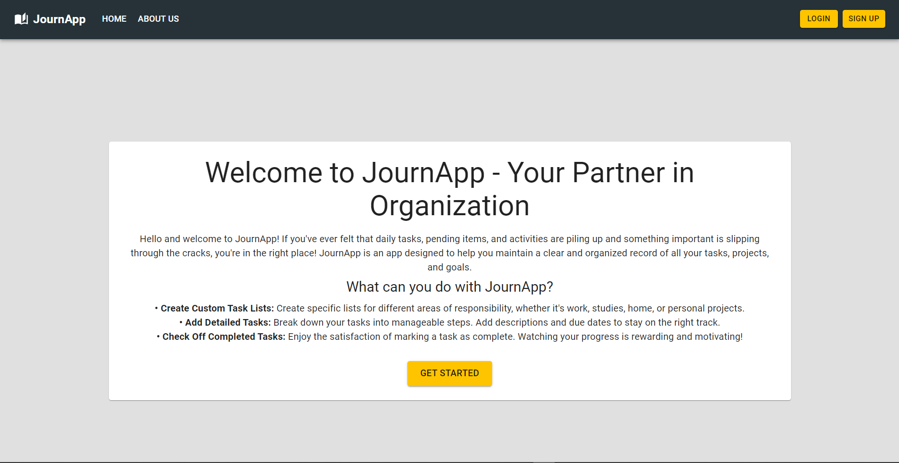
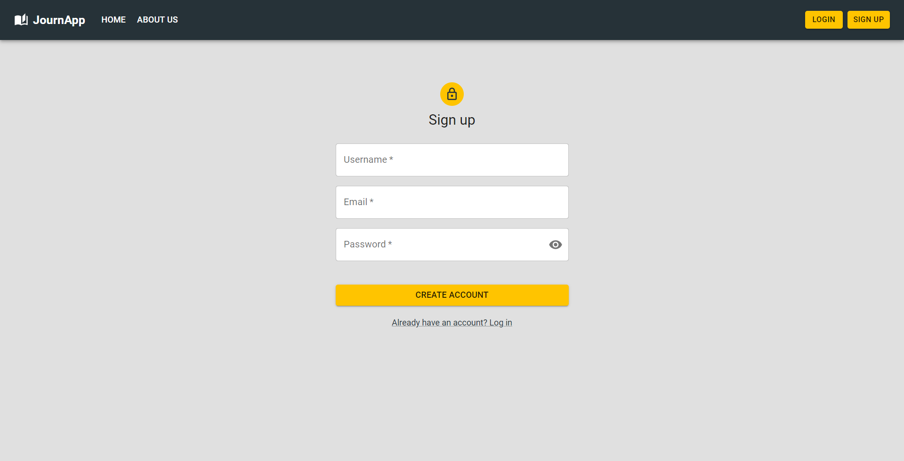
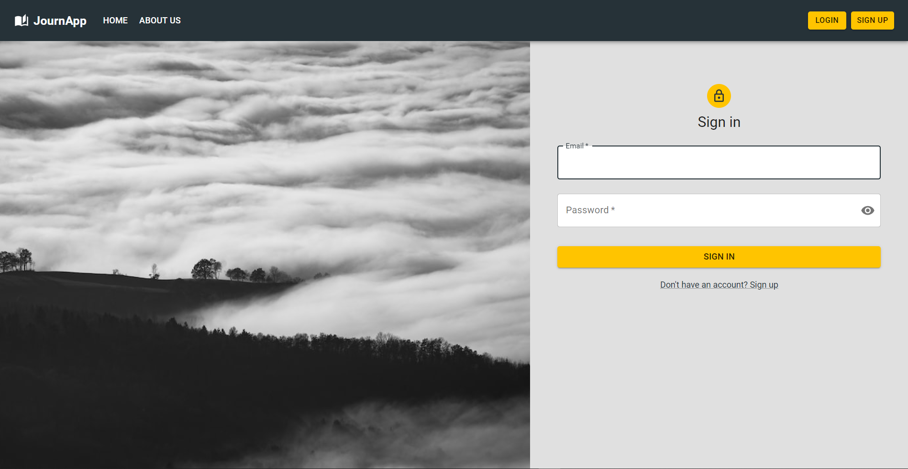
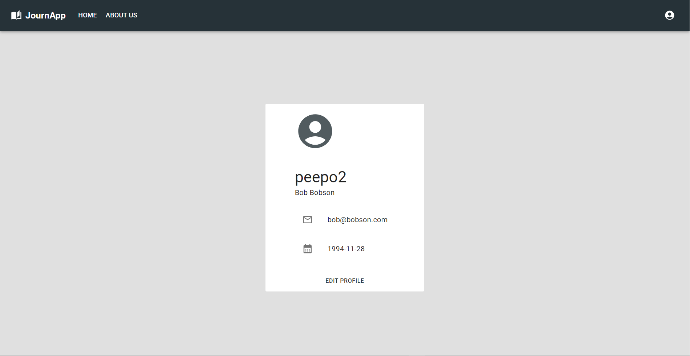
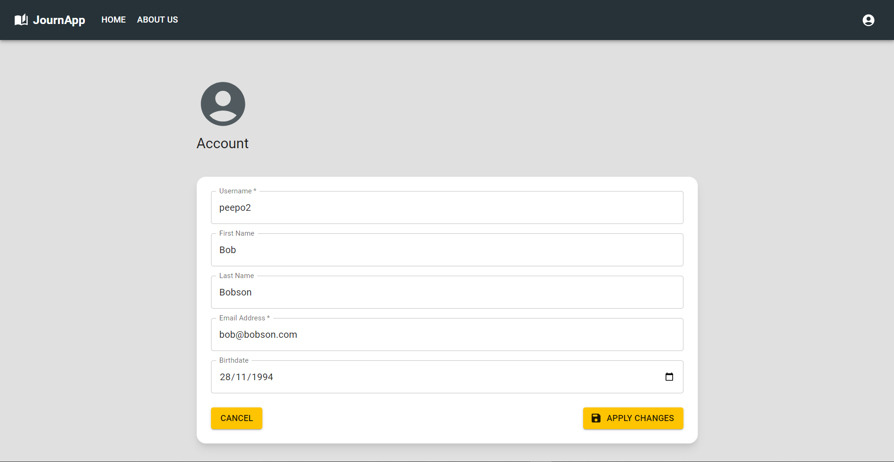
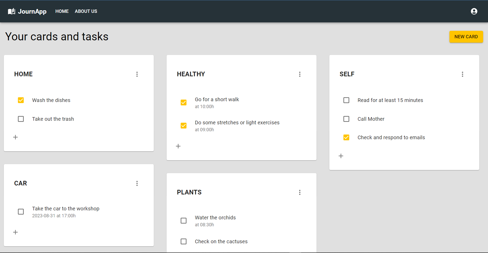

# Welcome to my frontend app

<details>
  <summary>Contenido 📝</summary>
  <ol>
    <li><a href="#objetivo-🎯">Objetivo</a></li>
    <li><a href="#sobre-el-proyecto-🔎">Sobre el proyecto</a></li>
    <!-- <li><a href="#deploy-🚀">Deploy</a></li> -->
    <li><a href="#stack">Stack</a></li>
    <li><a href="#instalación-en-local">Instalación</a></li>
    <li><a href="#vistas">Vistas</a></li>
    <li><a href="#credenciales">Credenciales</a></li>
    <li><a href="#futuras-funcionalidades">Futuras funcionalidades</a></li>
    <li><a href="#webgrafia">Webgrafia</a></li>
    <li><a href="#contacto">Contacto</a></li>
  </ol>
</details>

## Objetivo 🎯

Este proyecto requería conexión a una API funcional y usar React para crear una app.

## Sobre el proyecto 🔎

Se trata del frontend de una app tipo To Do List donde los ususarios pueden registrarse y acceder a los servicios de la app, como consultar sus tareas, crear, modificar o eliminarlas y cambiar sus datos de usuario. Pueden crear tarjetas y distribuir sus tareas en ellas, las tareas pueden contar con una fecha y hora objetivo, además se pueden marcar o desmarcar como completadas.

<!-- ## Deploy 🚀
<div align="center">
    <a href="https://www.google.com"><strong>Url a producción </strong></a>🚀🚀🚀
</div> -->

## Stack

<div align="center">
<a href="https://www.reactjs.com/">
    
</a>
<a href="https://redux-toolkit.js.org/">
    
</a>
<a href="https://mui.com/">
    
</a>
<a href="https://developer.mozilla.org/es/docs/Web/JavaScript">
    
</a>
 </div>

## Instalación en local

1. Clonar el repositorio
2. `$ npm install`
3. `$ npm run dev`

## Vistas

Home

Register

Login

Profile

Account

My Cards


## Credenciales

<details>
<summary>Credenciales</summary>

- AUTH

  - LOGIN

  Como usuario:

  ```js
          email: bob@bobson.com,
          password: 12345678
  ```

  <!-- Como admin:

  ```js
          email: admin@admin.com,
          password: 12345678
  ``` -->

  </details>

## Futuras funcionalidades
<!-- ✅ Vista actualizar rutinas -->
⬜ Buscador de palabras clave
⬜ Drag&Drop para ordenar las tarjetas
<!-- ⬜ ...   -->

## Webgrafia:

Para conseguir mi objetivo he recopilado información de:

- https://mui.com/material-ui/getting-started/
- https://es.react.dev/learn
- https://redux.js.org/introduction/getting-started

## Contacto

<a href = "mailto:adrianapardo1998@gmail.com"></a>
<a href="https://www.linkedin.com/in/adriana-pardo-diez/" target="_blank"></a>

</p>
